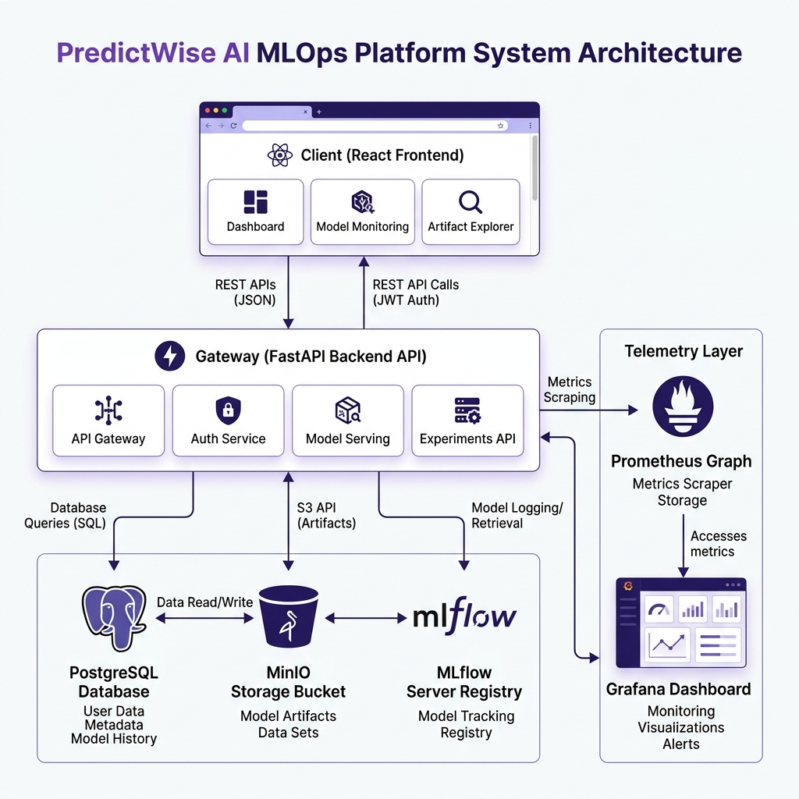

# PredictWise AI: End-to-End MLOps Customer Churn Platform

PredictWise AI is an enterprise-grade, end-to-end MLOps platform designed to predict, explain, and manage customer churn. It features automated feature engineering, hyperparameter optimization sweeps, experiment tracking, model registry transitions, explainable AI (SHAP), data drift monitoring, automated retraining loops, and detailed corporate reporting.

---

## 🏗️ Architecture Overview

The system is designed with a microservices architecture coordinated via Docker Compose:



### Core Components:
1. **Frontend**: React SPA (Vite + TypeScript + Tailwind CSS) providing intuitive dashboards for both business users and MLOps administrators.
2. **Backend**: FastAPI web services implementing JWT authentication, inference engines, dataset cataloging, drift monitoring, and scheduling.
3. **Database**: PostgreSQL storing user accounts, client prediction histories, and retraining job metadata.
4. **Artifact & Model Storage**: 
   - **MinIO**: S3-compatible object storage for CSV datasets, Evidently AI drift HTML reports, and serialized model files.
   - **MLflow**: Experiment tracking dashboard and Model Registry.
5. **Observability**: 
   - **Prometheus**: Scrapes application metrics (prediction distribution, latencies, error frequencies).
   - **Grafana**: Visualizes system performance, business KPIs, and service health.

---

## ✨ Key Features

* **🔐 User Authentication & RBAC**: JWT-based session security with distinct user directories (`Admin` for pipeline controls and monitoring, `Business User` for predictions and reporting).
* **🤖 Automated ML Pipeline**: Executes automated hyperparameter sweeps using **Optuna** across XGBoost, LightGBM, and Random Forest models. Logs F1, ROC-AUC, Accuracy, Precision, and Recall.
* **📈 Model Registry & Versioning**: Production-promotion flow with database caching. The backend automatically pulls the latest "Production" flagged model version from MLflow.
* **🔮 Explainable AI (SHAP)**: Explains individual churn predictions by identifying top positive and negative contributing factors, paired with actionable rules-based customer retention playbooks.
* **📊 Batch CSV Predictions & Adaptation**: Accepts standard Kaggle/IBM Telco Churn CSV formats, mapping and adapting schemas automatically.
* **🔍 Evidently AI Drift Detection**: Automatically performs Kolmogorov-Smirnov statistical tests on incoming batches and writes drift reports.
* **🔄 APScheduler Retraining Loop**: Regularly verifies data drift status; if concept drift exceeds a 30% threshold, it triggers an background retraining run automatically.
* **📉 Corporate Reporting**: Generates client audit reports (PDF via ReportLab) and executive business metrics reports (Excel via openpyxl) for offline business review.

---

## 📁 Repository Structure

```text
├── docker-compose.yml       # Docker Compose service definition
├── .gitignore               # Root git exclusions
├── README.md                # Main documentation
├── backend/
│   ├── app/
│   │   ├── main.py          # FastAPI server entrypoint
│   │   ├── core/            # Settings, DB session, S3 client, logging
│   │   ├── models/          # SQLAlchemy Database Models
│   │   ├── repositories/    # Database queries
│   │   ├── services/        # Business logic (Auth, Drift, Reporting, Pipeline)
│   │   └── ml/              # Model training, inference, and SHAP explainers
│   ├── tests/               # Authentication and pipeline test cases
│   ├── Dockerfile
│   └── requirements.txt
├── frontend/
│   ├── src/                 # React code (pages, components, context, types)
│   ├── public/              # Assets (favicon, icons)
│   ├── Dockerfile
│   └── package.json
├── mlflow/                  # MLflow server startup configurations
├── monitoring/              # Prometheus and Grafana dashboards configurations
└── Screenshots/             # Application interface screenshots
```

---

## 🚀 Quick Start Guide

### Prerequisites
Make sure you have [Docker](https://www.docker.com/) and [Docker Compose](https://docs.docker.com/compose/) installed on your machine.

### Spin Up the Platform
From the root directory of this project, execute:

```bash
docker compose up --build -d
```

Docker will build and run all 7 services: `db`, `minio`, `mlflow`, `backend`, `frontend`, `prometheus`, and `grafana`. 

### Initial Boot Auto-Seeding
Upon the first run, the backend container automatically:
1. Runs database migrations to set up tables.
2. Seeds a default administrative account.
3. Generates a synthetic dataset (`v1.0`), runs an Optuna hyperparameter sweep to train a model, logs it to MLflow, and promotes it to **Production**.
4. Seed-populates the database with historical client profiles so the dashboard is immediately populated.

---

## 🔗 Endpoint Portal

Once the services are active, you can access the components at the following local URLs:

| Service | Address | Default Credentials |
| :--- | :--- | :--- |
| **PredictWise AI Web Client** | [http://localhost:5174](http://localhost:5174) | Email: `admin@predictwise.com`<br>Password: `AdminPassword123!` |
| **FastAPI Swagger API Docs** | [http://localhost:8000/docs](http://localhost:8000/docs) | Log in using the Swagger OAuth authorize panel |
| **MLflow Registry Portal** | [http://localhost:5001](http://localhost:5001) | *No credentials required* |
| **MinIO Object Console** | [http://localhost:9001](http://localhost:9001) | User: `minioadmin`<br>Password: `minioadmin` |
| **Prometheus Gateway** | [http://localhost:9090](http://localhost:9090) | *No credentials required* |
| **Grafana Portal** | [http://localhost:3001](http://localhost:3001) | *No credentials required* |

---

## 📸 Interface Screenshots

Here is a preview of the PredictWise AI MLOps user interface:

### 1. Admin Dashboard Analytics


### 2. Single Customer Prediction & Explainable AI (SHAP)


### 3. Model Registry version transitions


### 4. MLflow experiments validation runs comparison


### 5. Evidently AI drift detection reports


### 6. Corporate PDF and Excel reporting down-loader


### 7. Grafana business metrics monitoring dashboard

